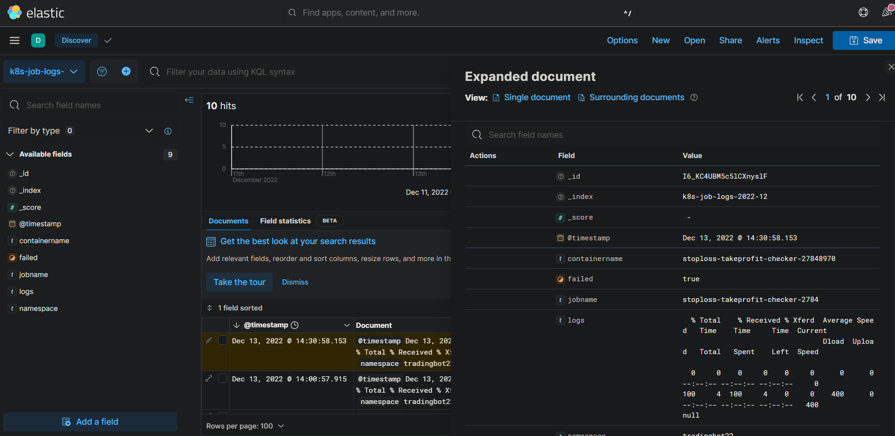

# kubernetes-job-monitoring-simple
a simple kubernetes job monitorer with elasticsearch + kibana as visualization

it queries the failed jobs using python and kubectl, parses them, and writes them into elasticsearch, where they can easily be visualized using kibana

## how does it work / why?

I did not want to install a full airflow/prefect to monitor my jobs. also keeping things simple keeps them stable ;)
I am running several cronjobs in my kubernetes cluster, and just want to monitor failed ones in a simple way
The Python job accesses kubernetes via kubectl, which has it's permissions from a ClusterRoleBinding/ServiceAccount. 

## installation

1. `kubectl apply -f kubernetes/`
2. wait until ressources in the "elk" namespace are installed
3. access Kibana via port-forward or by uncommenting the NodePort in [kubernetes/kibana-deployment.yaml](kubernetes/kibana-deployment.yaml)
    - `kubectl port-forward -n elk svc/kibana-service 56011:5601` & visit http://localhost:56011
    - Nodeport uncommented: Visit http://NODEIP:30005
4. Navigate to menu -> Stack Management -> (Kibana) Data Views
    - Click on "Create data view"
    - You should already see some Index called "k8s-job-logs-2022-12"
    - Call it whatever you want + Index Pattern "k8s-job-logs-*"
    - Select @timestamp for Timestamp field
    - "Save data view to Kibana"
5. Menu -> (Analytics) Discover
    - Enjoy. It should look similar to the image above